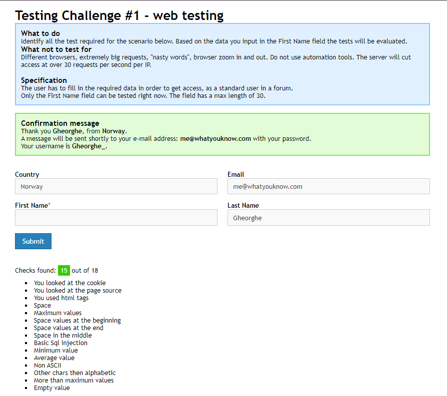
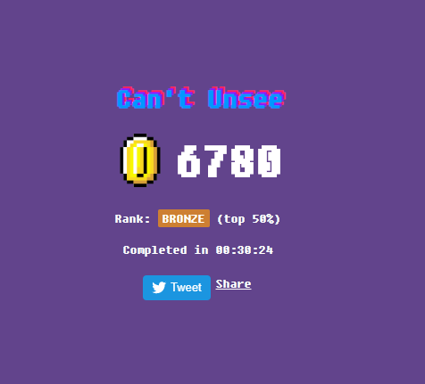

### Постройка
`./gradlew shadowJar` - jar будет в build/libs  
Вызов как обычный jar файл:  
`java -jar jarName` 

Тестирование (для Users) - по задаче 4:  
`./gradlew test`

---
### Задача 1
---

Testing challenge

Can't unsee

### Задача 2
---
Предоставлена в `Main.kt`

### Задача 3
---
[Документ](https://docs.google.com/document/d/1L-TzGXMRqJLNzu-dE1BkW-pTvNctGYOC_SghZeOxUQ4/edit?usp=sharing)

### Задача 4 (для Users)
---
Предоставлено в `test`
